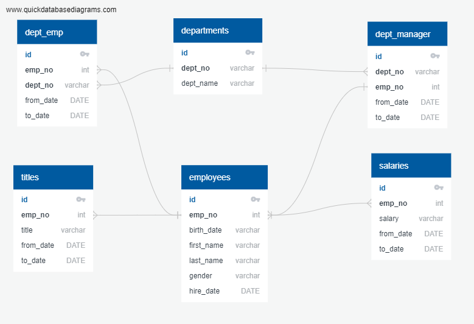

# SQL - Employee Database

## Scope: 

1. Data Modeling
2. Data Engineering
3. Data Analysis


#### Data Modeling

Database Design based on CSV data. Establishing relationship between different tables and columns to create a reference for Relational Database.



#### Data Engineering

Created Following Tables and imported Data from CSV:

```sql
'departments'
'dept_emp'
'dept_manager'
'employees'
'salaries'
'titles'
```

#### Data Analysis


1. List the following details of each employee: employee number, last name, first name, gender, and salary.
```sql
select 
	a.emp_no, 
	a.first_name,
	a.last_name,
	a.gender,
	b.salary
from employees a
inner join salaries b on a.emp_no=b.emp_no;
```

2. List employees who were hired in 1986.
```sql
select * from employees
where hire_date between '1986-01-01' and '1986-12-31'
order by hire_date desc;
```

3. List the manager of each department with the following information: 
department number, department name, the manager's employee number, last name, first name, 
and start and end employment dates.
```sql
select 
	a.dept_no,
	b.dept_name,
	a.emp_no,
	c.first_name,
	c.last_name,
	d.from_date as employment_start_date,
	d.to_date as employment_end_date	
from dept_manager a
left join departments b on a.dept_no=b.dept_no
left join employees c on a.emp_no=c.emp_no
left join dept_emp d on a.emp_no=d.emp_no;
```

4. List the department of each employee with the following information: 
employee number, last name, first name, and department name.
```sql
select 
	a.emp_no,
	a.first_name,
	a.last_name,
	c.dept_name
from employees a 
left join dept_emp b on a.emp_no=b.emp_no
left join departments c on b.dept_no=c.dept_no
order by emp_no;
```
This query gives dept_name of all the past depts of the employee including ex-employees. 
`Dense Rank` function can be used if only latest dept name is required.


5. List all employees whose first name is "Hercules" and last names begin with "B."
```sql
select * from employees
where first_name = 'Hercules' and last_name like 'B%'
```

6. List all employees in the Sales department, including their employee number, last name, first name, and department name.
```sql
select 
	a.emp_no,
	a.first_name,
	a.last_name,
	c.dept_name
from employees a 
left join dept_emp b on a.emp_no=b.emp_no
left join departments c on b.dept_no=c.dept_no
where dept_name='Sales'
order by emp_no;
```

7. List all employees in the Sales and Development departments, including their 
employee number, last name, first name, and department name.
```sql
select 
	a.emp_no,
	a.first_name,
	a.last_name,
	c.dept_name
from employees a 
left join dept_emp b on a.emp_no=b.emp_no
left join departments c on b.dept_no=c.dept_no
where c.dept_name='Sales' or c.dept_name='Development'
order by emp_no;
```

8. In descending order, list the frequency count of employee last names, i.e., how many employees share each last name.
```sql
select last_name, count(last_name)
from employees
group by last_name
order by last_name desc
```